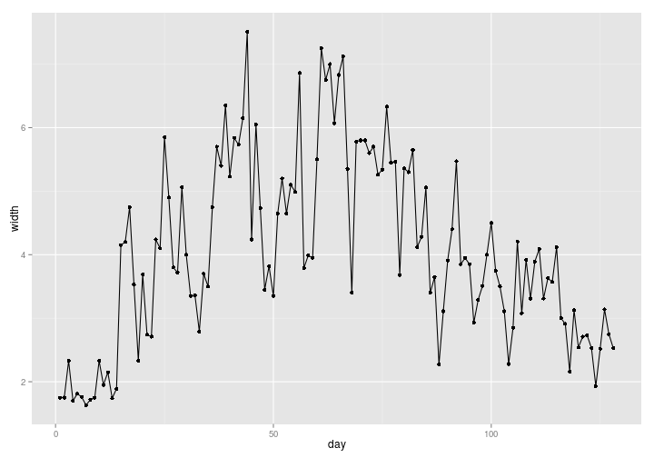
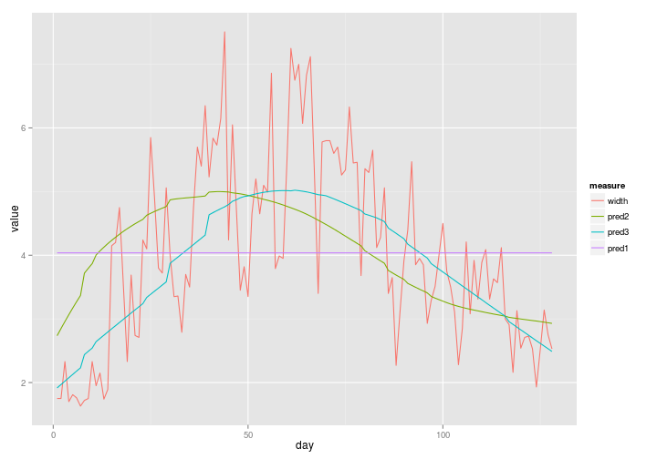
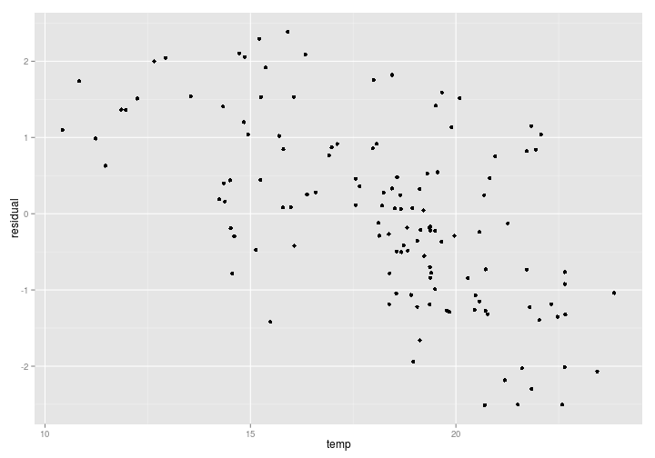
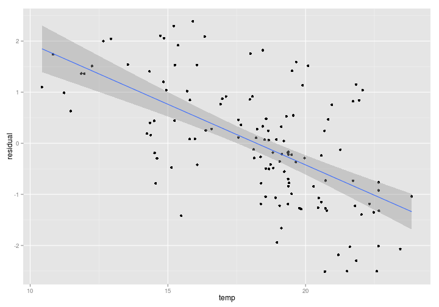

Homework 3 - Zachary Foster
==========


```r
library(knitr)
library(ggplot2)
library(reshape2)
library(nlme)
opts_chunk$set(fig.width = 10)
opts_knit$set(self.contained = TRUE)
```

1
---


```r
data <- read.table("lrs.txt", header=TRUE)
ggplot(data, aes(x = day, y = width)) +
  geom_line() +
  geom_point()
```

 


2
---

### A


```r
data$pred1 <- rep(mean(data$width), nrow(data))
molten_data <- melt(data, id.vars = c("day", "temp"),
                    variable.name = "measure")
ggplot(molten_data, aes(x = day, y = value, color = measure)) +
  geom_line()
```

 

### B


```r
sapply(c("pred1", "pred2", "pred3"),
       function(x) acf(data[, x] - data$width, plot = FALSE)[1]$acf)
```

```
##  pred1  pred2  pred3 
## 0.7590 0.6496 0.4643
```

The first order auto correlation coefficient of residuals decreases as baseline 1 to 3 is used. 
This is because these baseline estimates are increasingly more specific to the measured fish's growth pattern. 
Therefore, an increasing amount of variation in otolith growth is being accounted for when calculating the residual. 


3
---

### A


```r
data$residual <- data$pred2 - data$width 
ggplot(data, aes(x = temp, y = residual)) +
  geom_point() 
```

 

For this individual fish, there is a strong negative correlation between temperature and the difference from the average otolith growth of all fish.
This suggests that averaging over multiple fish from multiple time points removes some of the variation associated with temperature. 
Therefore, the prediction underestimates the association between otolith growth and temperature. 

### B


```r
model <- lm(data$residual ~ data$temp)
summary(model)
```

```
## 
## Call:
## lm(formula = data$residual ~ data$temp)
## 
## Residuals:
##     Min      1Q  Median      3Q     Max 
## -2.0672 -0.6733 -0.0412  0.4979  2.0087 
## 
## Coefficients:
##             Estimate Std. Error t value Pr(>|t|)    
## (Intercept)   4.3246     0.5113    8.46  5.8e-14 ***
## data$temp    -0.2374     0.0277   -8.57  3.1e-14 ***
## ---
## Signif. codes:  0 '***' 0.001 '**' 0.01 '*' 0.05 '.' 0.1 ' ' 1
## 
## Residual standard error: 0.93 on 126 degrees of freedom
## Multiple R-squared:  0.368,	Adjusted R-squared:  0.363 
## F-statistic: 73.4 on 1 and 126 DF,  p-value: 3.14e-14
```

```r
ggplot(data, aes(x = temp, y = residual)) +
  geom_point() +
  geom_smooth(method="lm")
```

 

There is a highly significant association ($P = 3.14\cdot{}10^{-14}$) between water temperature and the difference between observed and predicted otolith growth.
On average, every increase of $1^{\circ}C$ in water temperature is associated with the observed otolith growth being $0.237\mu{}m$ larger relative to the estimate. 


### C


```r
model <- gls(residual ~ temp, data = data, correlation = corAR1())
summary(model)
```

```
## Generalized least squares fit by REML
##   Model: residual ~ temp 
##   Data: data 
##     AIC   BIC logLik
##   333.5 344.8 -162.7
## 
## Correlation Structure: AR(1)
##  Formula: ~1 
##  Parameter estimate(s):
##    Phi 
## 0.4448 
## 
## Coefficients:
##              Value Std.Error t-value p-value
## (Intercept)  3.656    0.7758   4.713       0
## temp        -0.201    0.0421  -4.773       0
## 
##  Correlation: 
##      (Intr)
## temp -0.985
## 
## Standardized residuals:
##      Min       Q1      Med       Q3      Max 
## -2.12326 -0.64021 -0.02565  0.56561  2.03976 
## 
## Residual standard error: 0.9451 
## Degrees of freedom: 128 total; 126 residual
```


The adjustment for serial correlation nearly doubled the standard error of the coefficient for temperature.
The result is still highly significant however ($P \approx{} 0$) and has a similar magnitude ($-0.201\mu{}m/^{\circ}C$) of association between increment-width residual and temperature.
In this case, there is not any population being tested worth mentioning. 
Technically, this particular analysis is one sample of a Lost River sucker from Upper Klamath Lake. 
The single fish whose growth is being compared to the average is the population.
One could also say that the population is all Lost River suckers in Upper Klamath Lake, but again, it is only one sample, so what exactly is being sampled is subjective.
I expect that water temperature influences otolith growth rate in Lost River suckers in Upper Klamath Lake, but this analysis does not directly address that question. 
The relationship between increment-width residual and temperature for multiple fish would have to be used to answer that question. 
